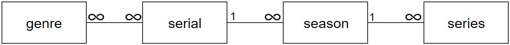
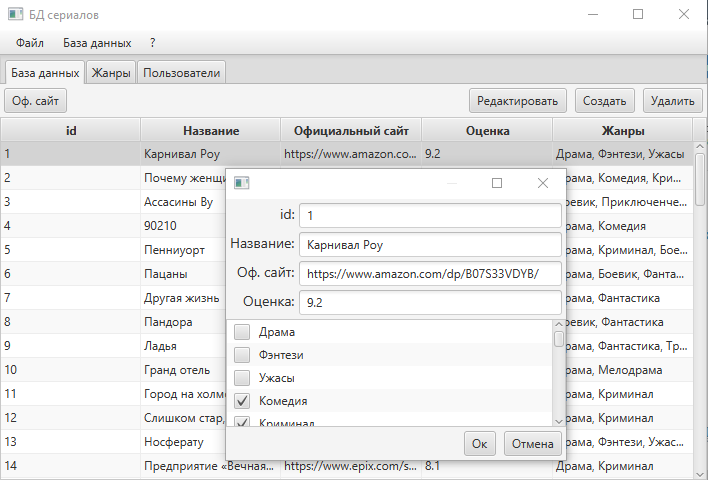
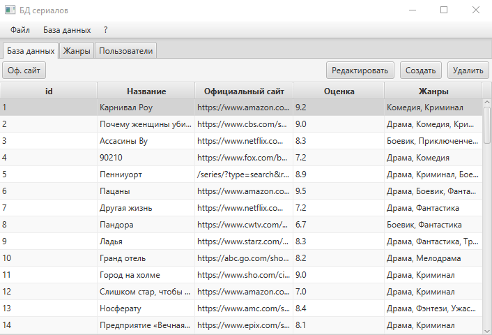

# Задача

1. Необходимо выбрать предметную область для создания базы данных. Была выбрана **база данных сериалов**.
2. Необходимо описать таблицы и их назначение. Выполнить проектирование логической структуры базы данных. Описать схему базы данных. Все реальные таблицы должны иметь 3 нормальную форму или выше. База данных должна иметь минимум 5 таблиц.
3. Необходимо разработать два клиентских приложения для доступа к базе данных. Данные приложения должны быть написаны на двух разных языках программирования и иметь разный интерфейс (например, классическое оконное приложение и web-приложение). Выбор языков программирования произволен.
4. Необходимо организовать различные роли пользователей и права доступа к данным. Далее, необходимо реализовать возможность создания архивных копий и восстановления данных из клиентского приложения.
5. При разработке базы данных следует организовать логику обработки данных не на стороне клиента, а, например, на стороне сервера, базы данных, клиентские приложения служат только для представления данных и тривиальной обработки данных.
6. База данных должна иметь представления, триггеры и хранимые процедуры, причем все эти объекты должны быть осмысленны, а их использование оправдано.

# База данных
## Сущности

## Структура

# [1-е приложение](https://github.com/Laiser399/05s-Java-SerialsDatabaseApp)

## Авторизация:

## Изменение:

# [2-е приложение](https://github.com/Laiser399/05s-WEB-SerialsDBWebPage)

